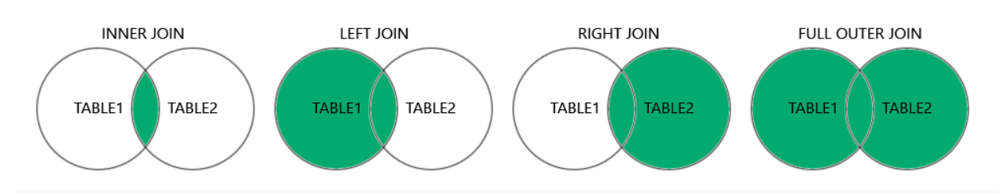

# MYSQL

## I. Bí danh (AS - Alias)
- Được dùng để đặt tên cho tên cột hoặc tên bảng
- Một alias chỉ tồn tại trong suốt quá trình truy vấn
### Syntax

Alias được sử dụng cho tên cột :
```sql
select column_name AS alias_name from table_name;
```

Alias được sử dụng cho tên bảng :
```sql
select column_name from table_name AS alias_name;
``` 

### Example
```sql
select o.orderID, c.CustomerID 
from Customers AS c, Orders AS o 
where c.CustomerName = 'customer' and c.CustomerID = o.CustomerID;
```

## II. Mệnh đề JOIN

Mệnh đề JOIN được sử dụng để kết hợp các hàng từ 2 hay nhiều bảng dựa trên 1 cột liên quan giữa chúng

> <b>INNER JOIN</b>: Trả về các bản ghi có giá trị trùng khớp trong cả 2 bảng. JOIN và INNER JOIN đều trả về cùng 1 kết quả.

> <b>LEFT JOIN</b>: Trả về tất cả các bản ghi từ bảng bên trái và các bản ghi trùng khớp từ bảng bên phải.

> <b>RIGHT JOIN</b>: Trả về tất cả các bản ghi từ bảng bên phải và các bản ghi trùng khớp từ bảng bên trái.

> <b>FULL JOIN</b>: Trả về tất cả các bản ghi khi có kết quả khớp ở bảng bên trái hoặc bên phải.



### JOIN Syntax
```sql
SELECT column_name
FROM table1
INNER JOIN table2
ON table1.column_name = table2.column_name;
```
### Example
JOIN is the same as INNER JOIN:

```sql
SELECT Products.ProductID, Products.ProductName, Categories.CategoryName
FROM Products
JOIN Categories ON Products.CategoryID = Categories.CategoryID;
```

## III. Toán tử UNION

Toán tử UNION được sử dụng để kết hợp tập kết quả của hai hoặc nhiều câu lệnh SELECT.

- Mọi câu lệnh SELECT trong UNION phải có cùng số cột
- Các cột cũng phải có kiểu dữ liệu tương tự
- Các cột trong mỗi câu lệnh SELECT cũng phải có cùng thứ tự

### UNION Syntax

Toán tử UNION chỉ chọn các giá trị riêng biệt theo mặc định. Để cho phép các giá trị trùng lặp, hãy sử dụng UNION ALL:
```sql
SELECT column_name FROM table1
UNION ALL
SELECT column_name FROM table2;
```

## IV. Mệnh đề GROUP BY
- Câu lệnh GROUP BY nhóm các hàng có cùng giá trị thành các hàng tóm tắt, chẳng hạn như "tìm số lượng khách hàng ở mỗi quốc gia".

- Câu lệnh GROUP BY thường được sử dụng với các hàm tổng hợp (COUNT(), MAX(), MIN(), SUM(), AVG()) để nhóm tập kết quả theo một hoặc nhiều cột.

### GROUP BY Syntax

```sql
SELECT column_name
FROM table_name
WHERE condition
GROUP BY column_name
ORDER BY column_name;
```
### Example
Câu lệnh SQL sau liệt kê số lượng khách hàng ở mỗi quốc gia:
```sql
SELECT COUNT(CustomerID), Country
FROM Customers
GROUP BY Country;
```
## V. Mệnh đề HAVING

Mệnh đề HAVING đã được thêm vào SQL vì từ khóa WHERE không thể được sử dụng với các hàm tổng hợp.

### HAVING Syntax
```sql
SELECT column_name
FROM table_name
WHERE condition
GROUP BY column_name
HAVING condition
ORDER BY column_name;
```

## VI. Biểu thức CASE

- Biểu thức CASE xem xét các điều kiện và trả về một giá trị khi điều kiện đầu tiên được đáp ứng (như câu lệnh if-then-else).
- Nếu không có phần ELSE và không có điều kiện nào đúng thì nó trả về NULL.

### CASE Syntax
```sql
CASE
    WHEN condition1 THEN result1
    WHEN condition2 THEN result2
    WHEN conditionN THEN resultN
    ELSE result
END;
```
### Example
```sql
SELECT OrderID, Quantity,
CASE
    WHEN Quantity > 30 THEN 'The quantity is greater than 30'
    WHEN Quantity = 30 THEN 'The quantity is 30'
    ELSE 'The quantity is under 30'
END AS QuantityText
FROM OrderDetails;
```
Results:
```
OrderID	    Quantity	QuantityText
10248	    12	        The quantity is under 30
10248	    10	        The quantity is under 30
10248	    5	        The quantity is under 30
``` 
## VII. Hàm CAST() / CONVERT()

Hàm CAST() / CONVERT() chuyển đổi một giá trị (thuộc bất kỳ loại nào) thành kiểu dữ liệu được chỉ định.

### CAST / CONVERT Syntax
```sql
CAST(value AS Datatype)
CONVERT(value, Datatype)
CONVERT(value USING charset) (charset: Bộ ký tự để chuyển đổi thành)
SELECT CONVERT("W3Schools.com" USING latin1); => string latin: "W3Schools.com"
```
### Datatypes

<table>
    <thead>
        <tr>
            <th>Datatype</th>
            <th>Descriptions</th>
            <th>Example</th>
        </tr>
    </thead>
    <tbody>
        <tr>
            <td>DATE</td>
            <td>Chuyển đổi giá trị thành DATE. Định dạng: "YYYY-MM-DD"</td>
        </td>
        <tr>
            <td>DATETIME</td>
            <td>Chuyển đổi giá trị thành DATETIME. Định dạng: "YYYY-MM-DD HH:MM:SS"</td>
        </tr>
        <tr>
            <td>TIME</td>
            <td>Chuyển đổi giá trị thành TIME. Định dạng: "HH:MM:SS"</td>
            <td>SELECT CAST("14:06:10" AS TIME);</td>
        </tr>
        <tr>
            <td>CHAR</td>
            <td>Chuyển đổi giá trị thành chuỗi ký tự (chuỗi có độ dài cố định)</td>
            <td>SELECT CAST(65 AS CHAR);<br>Result: '65'</td>
        </tr>
        <tr>
            <td>SIGNED</td>
            <td>Chuyển đổi giá trị thành SIGNED (số nguyên 64 bit có dấu)</td>
            <td>SELECT CAST(5-10 AS SIGNED);<br>Result: -5</td>
        </tr>
        <tr>
            <td>UNSIGNED</td>
            <td>Chuyển đổi giá trị thành UNSIGNED (số nguyên 64 bit không dấu)</td>
        </tr>
        <tr>
            <td>BINARY</td>
            <td>Chuyển đổi giá trị thành BINARY (chuỗi nhị phân)</td>
        </tr>
        <tr>
            <td>DECIMAL</td>
            <td>Chuyển đổi giá trị thành DECIMAL.<br>Sử dụng tham số M và D tùy chọn để chỉ định số chữ số tối đa (M) và số chữ số theo sau dấu thập phân (D).</td>
        </tr>
    </tbody>
</table>

## VIII. Hàm CONV()

Hàm CONV() chuyển đổi một số từ hệ cơ số này sang hệ cơ số khác và trả về kết quả dưới dạng giá trị chuỗi.

### CONV Syntax
```sql
CONV(number, from_base, to_base)
```
```
Parameter	    Description
number	        Yêu cầu là một số
from_base	    Hệ cơ số của số (một số từ 2 đến 36)
to_base	        Hệ cơ số để chuyển đổi thành (một số từ 2 đến 36 hoặc -2 và -36)
```
```sql
SELECT CONV(1111, 2, 10);
Result: "15"
```

## IX. Hàm IF()
Hàm IF() trả về một giá trị nếu điều kiện là TRUE hoặc trả về một giá trị khác nếu điều kiện là FALSE.

### IF Syntax
```sql
IF(condition, value_if_true, value_if_false)
```
### Parameter Values
```
Parameter	    Description
condition	    Điều kiện
value_if_true	Giá trị trả về nếu điều kiện là TRUE
value_if_false	Giá trị trả về nếu điều kiện là TRUEFALSE
```

### Example
```sql
SELECT IF(500<1000, "YES", "NO");
SELECT OrderID, Quantity, IF(Quantity>10, "MORE", "LESS")
FROM OrderDetails;
```

## X. Hàm SYSTEM_USER()

Hàm SYSTEM_USER() trả về tên người dùng và tên máy chủ hiện tại cho kết nối MySQL.
```sql
SELECT SYSTEM_USER();
-- or --
SELECT SESSION_USER();
-- or --
USER();
```

## XI. Các Hàm chuỗi trong MYSQL

<table>
    <thead>
        <tr>
            <th>#</th>
            <th>Name</th>
            <th>Descriptions</th>
            <th>Note</th>
            <th>Example</th>
        </tr>
    </thead>
    <tbody>
        <tr>
            <td>1</td>
            <td><b>ASCII(character)</b></td>
            <td>Trả về giá trị ASCII cho ký tự cụ thể</td>
            <td>...</td>
            <td>...</td>
        </tr>
        <tr>
            <td>2</td>
            <td><b>CHAR_LENGTH(string)</b></td>
            <td>Trả về độ dài của một chuỗi </td>
            <td>...</td>
            <td>...</td>
        </tr>
        <tr>
            <td>3</td>
            <td><b>CHARACTER_LENGTH(string)</b></td>
            <td>Trả về độ dài của một chuỗi </td>
            <td>Giống CHAR_LENGTH</td>
            <td>...</td>
        </tr>
        <tr>
            <td>4</td>
            <td><b>CONCAT(str1, str2, str3,...)</b></td>
            <td>Cộng các chuỗi lại với nhau</td>
            <td>...</td>
            <td>SELECT CONCAT(Address, " ", PostalCode, " ", City) AS Address FROM Customers;</td>
        </tr>
        <tr>
            <td>5</td>
            <td><b>FIELD(value, val1, val2, val3, ...)</b></td>
            <td>Trả về vị trí chỉ mục của một giá trị trong danh sách các giá trị.</td>
            <td>Works in: From MySQL 4.0</td>
            <td>...</td>
        </tr>
        <tr>
            <td>6</td>
            <td><b>INSERT(string1, position, number, string2)</b></td>
            <td>Chèn chuỗi string2 vào chuỗi string1 tại vị trí đã chỉ định và cho một số ký tự nhất định.</td>
            <td>Nếu vị trí nằm ngoài độ dài của chuỗi, hàm này trả về chuỗi<br>Nếu số lớn hơn độ dài của phần còn lại của chuỗi, hàm này sẽ thay thế chuỗi từ vị trí cho đến hết chuỗi</td>
            <td>...</td>
        </tr>
        <tr>
            <td>7</td>
            <td><b>INSTR(string1, string2)</b></td>
            <td>Trả về vị trí xuất hiện đầu tiên của string2 trong string1.</td>
            <td>...</td>
            <td>...</td>
        </tr>
        <tr>
            <td>8</td>
            <td><b>LCASE(TEXT)</b></td>
            <td>Chuyển đổi một chuỗi thành chữ thường</td>
            <td>...</td>
            <td>...</td>
        </tr>
        <tr>
            <td>9</td>
            <td>
                <b>LCASE(TEXT)</b><br>
                <b>LOWER(TEXT)</b>
            </td>
            <td>Chuyển đổi một chuỗi thành chữ thường</td>
            <td>...</td>
            <td>SELECT UCASE("SQL");</td>
        </tr>
        <tr>
            <td>10</td>
            <td>
                <b>UCASE(TEXT)</b><br>
                <b>UPPER(TEXT)</b>
            </td>
            <td>Chuyển đổi một chuỗi thành chữ hoa</td>
            <td>...</td>
            <td>SELECT UCASE("sql");</td>
        </tr>
        <tr>
            <td>11</td>
            <td><b>REPEAT(string, number)</b></td>
            <td>Lặp lại một chuỗi nhiều lần theo number.</td>
            <td>...</td>
            <td>SELECT REPEAT("SQL", 3);</td>
        </tr>
        <tr>
            <td>12</td>
            <td><b>REVERSE(string)</b></td>
            <td>Đảo ngược một chuỗi và trả về kết quả.</td>
            <td>...</td>
            <td>SELECT REVERSE("SQL");</td>
        </tr>
        <tr>
            <td>13</td>
            <td><b>STRCMP(string1, string2)</b></td>
            <td>So sánh hai chuỗi.</td>
            <td>If string1 = string2, this function returns 0<br>
                If string1 < string2, this function returns -1<br>
                If string1 > string2, this function returns 1</td>
            <td>SELECT STRCMP("SQL", "SQL");</td>
        </tr>
        <tr>
            <td>14</td>
            <td>
            <b>SUBSTR(string, start, length)</b>
            <b>SUBSTRING(string, start, length)</b>
            </td>
            <td>Trích xuất một chuỗi con từ một chuỗi (bắt đầu từ bất kỳ vị trí nào).</td>
            <td>Hàm SUBSTR() và MID() tương đương với hàm SUBSTRING().</td>
            <td>SELECT SUBSTR("SQL", 1, 1);<br>Result:  'S'</td>
        </tr>
    </tbody>
</table>

## XII. Các hàm nâng cao của MySQL

<table>
    <thead>
        <tr>
            <th>#</th>
            <th>Name</th>
            <th>Décriptions</th>
            <th>Note</th>
            <th>Example</th>
        </tr>
    </thead>
    <tbody>
        <tr>
            <td>1</td>
            <td>BIN(number)</td>
            <td>Trả về biểu diễn nhị phân của một số, dưới dạng giá trị chuỗi.</td>
            <td>...</td>
            <td>SELECT BIN(11);<br>Result: 1011</td>
        </tr>
        <tr>
            <td>2</td>
            <td>BINARY value</td>
            <td>Chuyển đổi một giá trị thành chuỗi nhị phân.</td>
            <td>Hàm này tương đương với việc sử dụng CAST(giá trị NHƯ BINARY).</td>
            <td>
                SELECT BINARY "W3Schools.com";<br>
                Ở đây, MySQL thực hiện so sánh từng byte của "HELLO" và "hello" rồi trả về 0 (vì trên cơ sở từng byte, chúng KHÔNG tương đương):<br>
                SELECT BINARY "HELLO" = "hello";
            </td>
        </tr>
    </tbody>
</table>